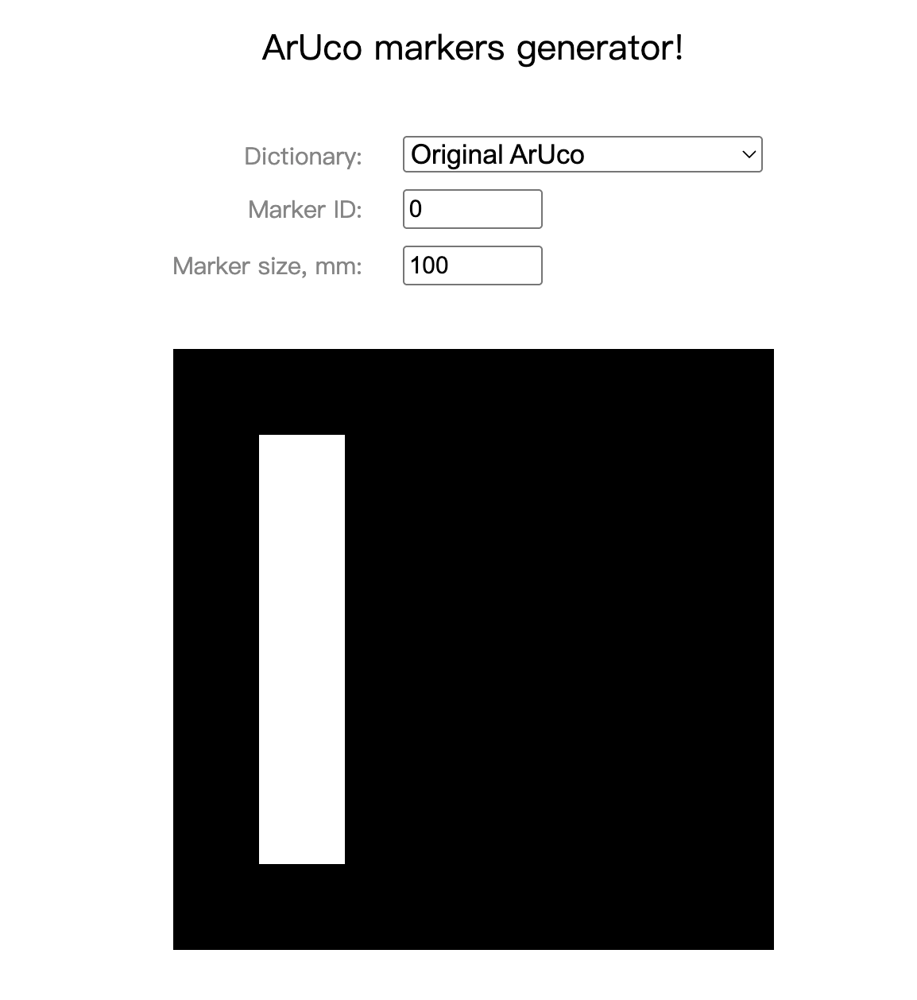
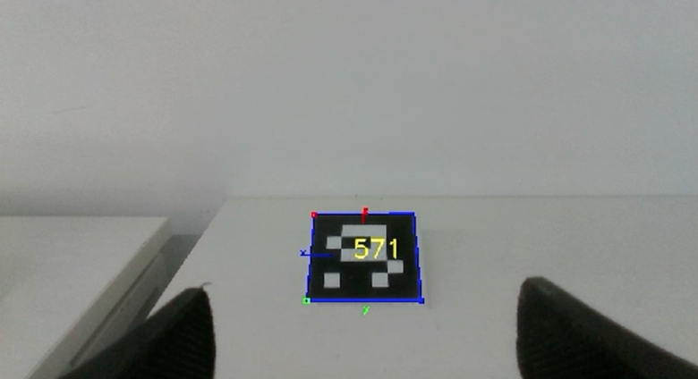
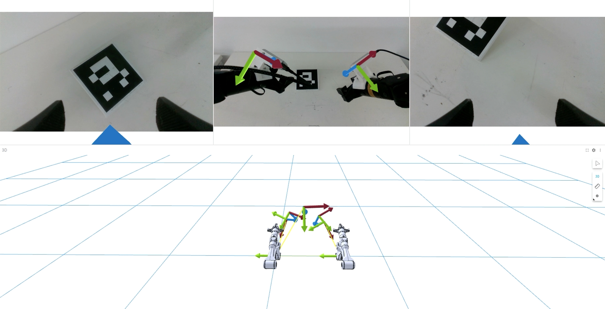

# RoboOrchard Calibrator Toolkit

The RoboOrchard Calibrator is a tool providing robust hand-eye calibration for robotic arm, using this tool you can get accurate external parameters for the robotic arm's end_effector or base_link between camera.

## Key Features
1. **Robot end-effector pose and aruco marker pose record**: By teleoperation(e.g.manual guiding and ALOHA) or specifying a set of actual points, the aruco_marker is made to appear within the camera's field of view, thereby obtaining data pairs.
2. **Eye-in-hand and Eye-to-hand calibration mode**: Once sufficient data pairs have been collected, the calibration can be completed according to the configuration, and the results can be obtained.
3. **Calibration result visulization**: By publishing the calibration results to the tf_tree of ROS2, the calibration results can be visualized in 3D through foxglove or RViz.

## Core Components

The repository is organized into **ROS 2 Calibrator Node (robo_orchard_calibrator)**  

This is the core of this ros2 package. It will handles and records the low-level tasks of subscribing to topics and get the calibration result. Its behavior is controlled by a detailed JSON configuration file.


## Getting Started

### Installation
1. clone aruco_ros package
```bash
cd ros2_ws/src
git clone https://github.com/pal-robotics/aruco_ros -b humble-devel
```  

2. build aruco_ros package

```bash
make ros2_build
```  

3. Print ArUco Marker  

You can print the ArUco marker from this website: https://chev.me/arucogen/, choose original aruco dictionary, marker ID and marker size, then you could print it.
<div align="center">
  
</div>
After printing, you need to place it on the table(eye-in-hand) or fix it to the end of the end_effector(eye-to-hand).

### Running an Example

After completing the preparations, you should specify the marker size, marker ID and remapping topics, then run the example to get eye-in-hand calibration result.
```bash
# start your camera first, then run aruco_ros 
ros2 run aruco_ros single --ros-args --remap /camera_info:=/your/camera_info/topic /image:=/your/camera_raw/topic -p marker_size:=0.1 -p marker_id:=100 -p camera_frame:="camera_frame" -p marker_frame:="marker_frame"  

# run robo_orchard_calibrator
ros2 run robo_orchard_calibrator calibrator_run --ros-args -p config_file:=example/robo_orchard_calibrator/robo_orchard_calibrator_example.json
```

### Calibration Method
This calibration tool relies on manually moving the robotic arm to obtain corresponding ee_pose and aruco_marker pose pairs. The manual movement methods include but are not limited to ALOHA, teleoperation, drag teaching, and sending fixed points. Taking ALOHA as an example, you should move the master arm to make the aruco_marker appear within the camera’s field of view as specified in the config file. Keep the robotic arm stationary, press "r" to record a pair of points. **You need to record at least three sets of points and strive to ensure diversity in the ee_poses.** Then press "q" to obtain the calibration results. Here is a visualization of a sample data collection position.  
You could visualize aruco pose in real time by Rviz or Foxglove by ros2 topic `/aruco_single/result`, and you could echo actual pose by tos2 topic `/aruco_single/pose`.

<div align="center">
  
</div>  

You will obtain a JSON file containing the calibration results, which should look like this:
```json
{
    "parent_frame": "",
    "child_frame": "",
    "result": {
        "position": [
            0.0,
            0.0,
            0.0
        ],
        "orientation": [
            0.0,
            0.0,
            0.0,
            1.0
        ]
    }
}
```
### Result Visulization
As the same time, this node will publish transform to /tf_static, you could visulize the result in Rviz or Foxglove and do a quick check whether the extrinsic result is correct. Here is a example for visulization in foxglove.



## License

This project is licensed under the [Apache License 2.0](https://github.com/HorizonRobotics/robo_orchard_deploy_ros2/blob/master/LICENSE) License. See the LICENSE file for details.