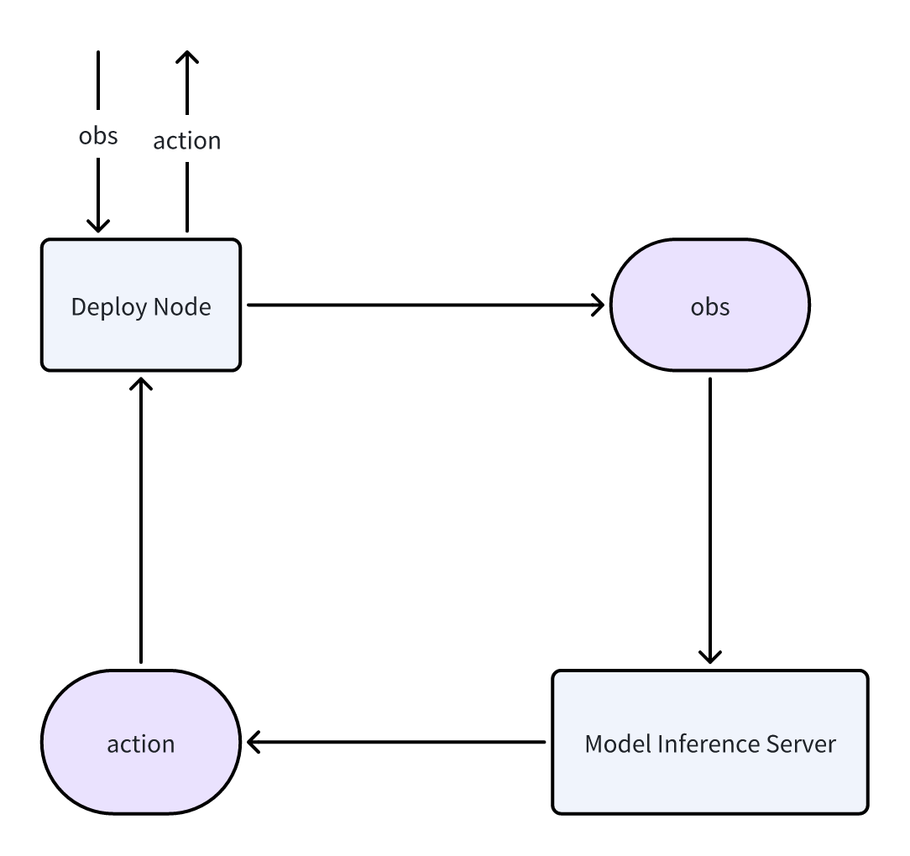

# RoboOrchard Deployment Toolkit

The RoboOrchard Deployment is a tool providing robust deployment pipeline for VLA policy model inference in real robot.  
> So far, we have only provided configurations for dual arm deployment. Single arm deployment is theoretically also possible, but we do not provide a separate implementation for this.
## Key Features
<div align="center">
  
</div>

**Get observation and publish control**: By subscribing to the corresponding observation topic, observations are obtained, then pull a request the model server, the model inference result is obtained, and sent to the real robot.

## Core Components

The repository is organized into **ROS 2 Deployment Node (robo_orchard_deploy)**  

This is the core of this ros2 package. It will handles and records the low-level tasks of subscribing to topics and publish control signal to real robot. Its behavior is controlled by a detailed JSON configuration file, you could easily change your policy by use different policy inference server port.


## Getting Started

### Running an Example

After successful installation, you can modify the example config file and run the example to run real robot inference.
1. Run deploy node  
You should run your model server in actual port, we give a example in `example/robo_orchard_deploy/model_infer_server.py`
2. Make your own deploy config  
You should make your own config corresponding to your model, we give a example in `example/robo_orchard_deploy/robo_orchard_deploy_example.json`.  
3. Run robo_orchard_deploy
```bash
ros2 launch robo_orchard_deploy launch_dual_arm_sync_deployment.launch.py config_file:=example/robo_orchard_deploy/robo_orchard_deploy_example.json
```

## License

This project is licensed under the [Apache License 2.0](https://github.com/HorizonRobotics/robo_orchard_deploy_ros2/blob/master/LICENSE) License. See the LICENSE file for details.
